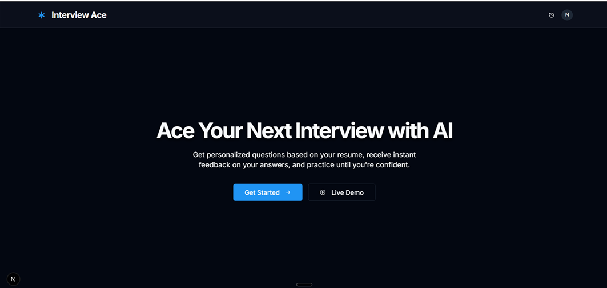
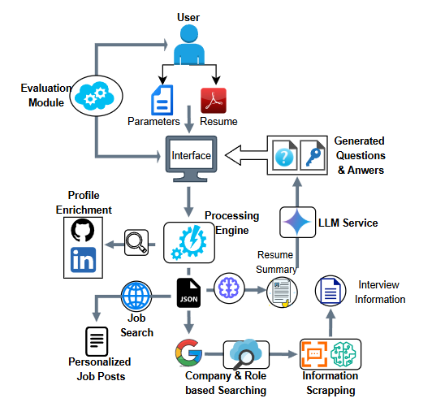
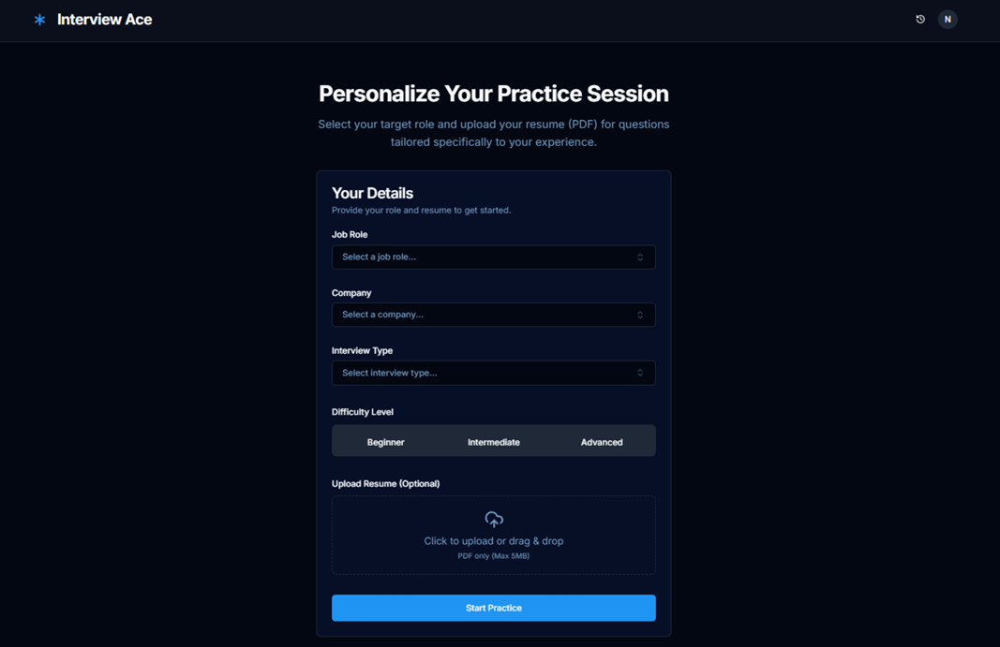
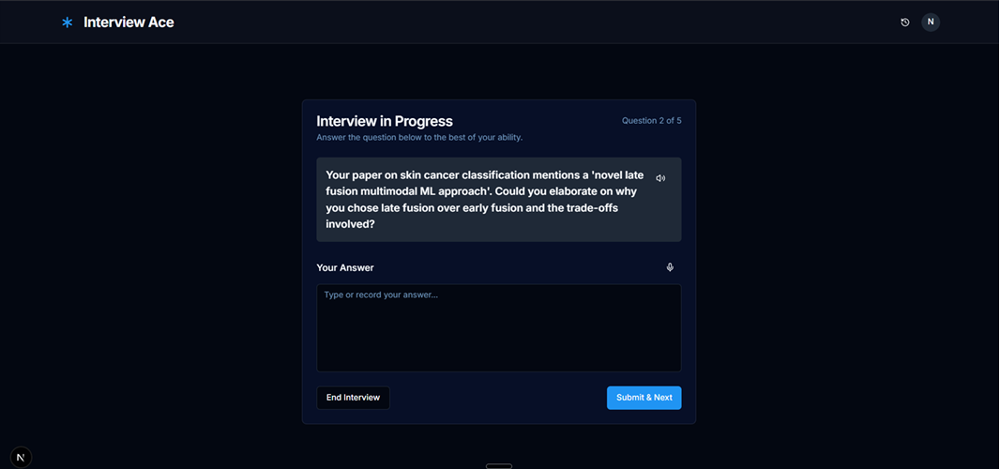
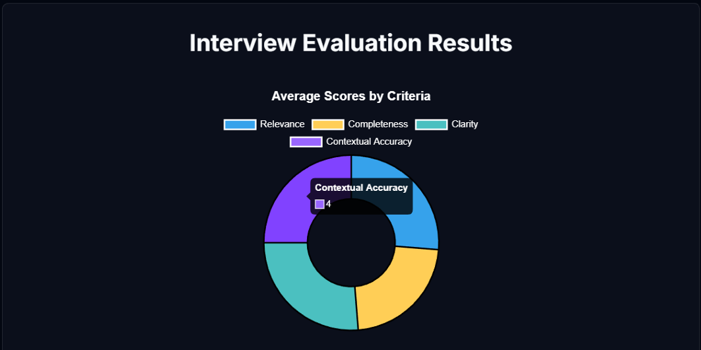
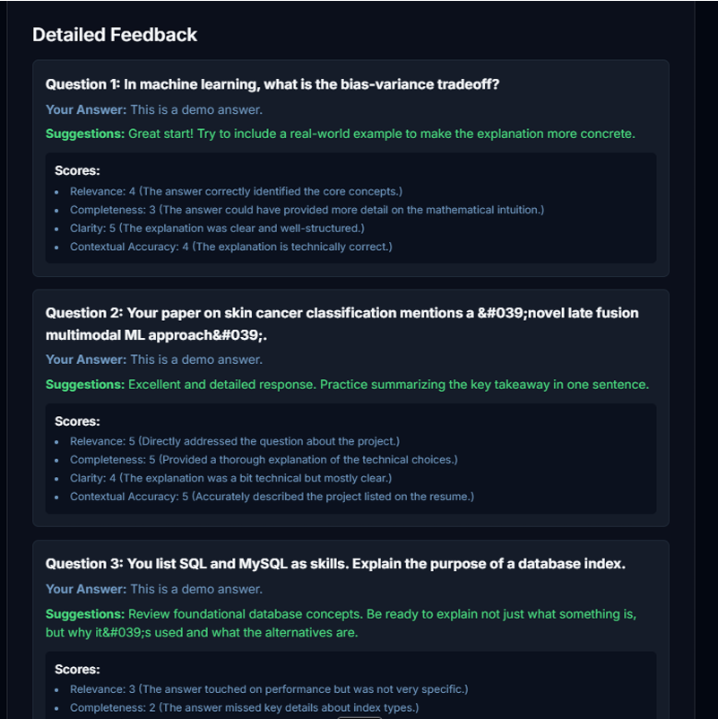
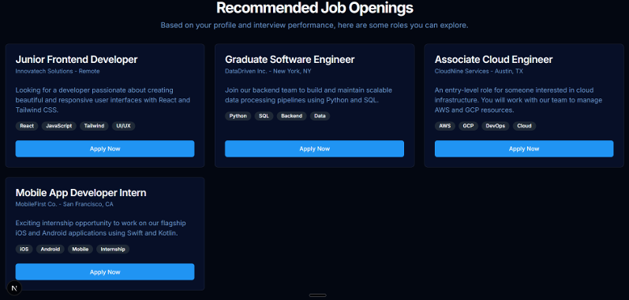

# PrepGuide – AI Interview Assistant

> **"Ace Your Next Interview with AI"**  
> An end-to-end, resume-personalized interview preparation system powered by multi-agent AI orchestration.


<!-- Replace with actual screenshot of the Interview Ace landing page -->

---

## Table of Contents

- [Overview](#overview)
- [Key Features](#key-features)
- [System Architecture](#system-architecture)
- [Multi-Agent Pipeline (CrewAI)](#multi-agent-pipeline-crewai)
- [Workflow](#workflow)
- [Project Folder Structure](#project-folder-structure)
- [Technologies Used](#technologies-used)
- [Installation](#installation)
- [Environment Variables](#environment-variables)
- [Running the Backend](#running-the-backend)
- [Exposing Backend via Ngrok](#exposing-backend-via-ngrok)
- [Running the CrewAI Pipeline (Test Mode)](#running-the-crewai-pipeline-test-mode)
- [Screenshots](#screenshots)
- [Evaluation Framework](#evaluation-framework)
- [Current Limitations](#current-limitations)
- [Future Improvements](#future-improvements)
- [Research Paper](#research-paper)
- [Author](#author)
- [License](#license)

---

## Overview

Traditional interview preparation relies on generic question banks and static mock interviews that lack personalized, contextual feedback. **PrepGuide** addresses this by building a complete AI-driven interview pipeline that:

- Parses your uploaded resume to understand your skills and experience
- Generates personalized **technical**, **behavioral**, and **scenario-based** interview questions for your target role and company
- Simulates a real interview with **Speech-to-Text (STT)** and **Text-to-Speech (TTS)**
- Evaluates your responses across **four qualitative criteria** using Gemini Pro LLM
- Recommends relevant **job listings** matched to your profile

The system is built on **CrewAI multi-agent orchestration**, **Google Gemini 2.5 Pro**, a **FastAPI** backend, and a **Next.js + Firebase** frontend.

---

## Key Features

### Resume-Based Personalization
PrepGuide parses your uploaded resume to extract skills, projects, and experience, generating interview questions tailored specifically to your background and the target role.

### AI-Powered Question Generation
Using **Gemini 2.5 Pro**, the system generates three types of questions:
- Technical questions
- Behavioral questions
- Scenario/resume-based questions

Each question includes a **model answer** for self-guided learning.

### Interactive Mock Interview
The platform simulates a real interview environment with:
- Questions delivered sequentially
- **Speech-to-Text (STT)** via browser's native `SpeechRecognition` API
- **Text-to-Speech (TTS)** via browser's native `SpeechSynthesis` API
- Real-time progress tracking

### Multi-Criteria Answer Evaluation
After the interview, responses are evaluated across four metrics using LLM reasoning:

| Criterion | Description |
|---|---|
| Relevance | Alignment with the interview question |
| Completeness | Coverage of key concepts |
| Clarity | Logical structure and grammar |
| Contextual Accuracy | Consistency with your resume |

Scores are visualized with **Chart.js donut charts** and accompanied by per-question qualitative feedback.

### Job Recommendation Engine
Based on your resume and selected role, the system retrieves **relevant job listings** from LinkedIn via the Serper API and displays them in a dedicated recommendations page.

### Asynchronous Architecture
Heavy AI tasks (resume parsing, question generation, job search) run in background threads via **CrewAI agents**. The frontend polls for session status, staying fully responsive while the pipeline completes (~3–4 minutes).

---

## System Architecture

```
Frontend (Next.js + Firebase)
            ↓
        Ngrok Tunnel
            ↓
Backend (FastAPI – Local Server)
            ↓
CrewAI Multi-Agent Pipeline
            ↓
Google Gemini LLM APIs (Gemini 2.5 Pro)
```


<!-- Replace with the actual architecture diagram from the paper (Fig. 1) -->

The architecture is composed of four loosely coupled layers:

1. **Frontend (Client)** – Next.js/React app hosted on Firebase. Handles resume upload, interview simulation, speech interaction, and evaluation dashboard.
2. **Backend (Local Server)** – Python FastAPI server exposing REST endpoints for session management, pipeline orchestration, and evaluation.
3. **Asynchronous Bridge (Ngrok)** – Exposes the local FastAPI server to the public internet, enabling the Firebase-hosted frontend to securely communicate with the backend.
4. **Core AI Engine (CrewAI)** – A group of specialized autonomous agents that execute the content generation pipeline asynchronously in the background.

---

## Multi-Agent Pipeline (CrewAI)

PrepGuide uses **8 specialized AI agents**, each with a defined role and expected output format:

| Agent | Role |
|---|---|
| Resume Extractor Agent | Extracts skills, projects, and experience from the resume PDF |
| Resume Summarizer Agent | Generates a structured candidate profile summary |
| Question Generator Agent | Creates role-specific and resume-based interview questions |
| Answer Generator Agent | Generates model answers for each question |
| Job Search Agent | Retrieves fresher job listings via Serper API (LinkedIn) |
| Job Matching Agent | Ranks and filters jobs based on resume skill alignment |
| Evaluation Agent | Evaluates candidate responses against model answers |

Each agent outputs structured **Markdown or JSON** artifacts saved to a session-specific directory, which serve as inputs to the next agent in the pipeline.

---

## Workflow

```
1️⃣  User uploads resume (PDF) + enters target role & company
2️⃣  Backend creates unique session folder (uuid4)
3️⃣  FastAPI immediately returns session ID (200 OK)
4️⃣  Frontend begins polling /get-session-status/ every 10 seconds
5️⃣  Background thread triggers CrewAI pipeline:
       ├── Phase 1: Resume extraction & candidate summary
       ├── Phase 2: Job search & filtering (top 10 listings)
       ├── Phase 3: Interview question generation
       └── Phase 4: Model answer generation
6️⃣  Session status set to "ready"
7️⃣  Frontend loads interview questions → simulation begins
8️⃣  User answers via voice (STT) or text input
9️⃣  Responses POST'd to /evaluate-answers/
🔟  Gemini Pro evaluates answers → returns JSON feedback
1️⃣1️⃣ Dashboard renders scores + qualitative feedback
1️⃣2️⃣ Job recommendations displayed on demand
```

---

## Project Folder Structure

```
PrepGuide/
│
├── agents/                  # CrewAI agent definitions
├── tools/                   # Custom tools used by agents
├── tasks/                   # Task definitions for CrewAI pipeline
├── tasks_refactored/        # Updated task configurations
│
├── questions_folder/        # Generated interview questions
├── answers_folder/          # Generated model answers
│
├── sessions/                # Session-based storage for user runs
│   └── <session_id>/        # Per-user session directory
│       ├── resume.pdf
│       ├── candidate_summary.md
│       ├── interview_questions.md
│       ├── model_answers.md
│       └── recommended_jobs.md
│
├── uploads_gradio/          # Uploaded resume files
│
├── candidate_summary/       # Generated candidate summaries
├── interview_questions/     # Question files
├── recommended_jobs/        # Job recommendation outputs
│
├── files_split/             # File processing utilities
├── split_files/             # Question/answer splitting modules
│
├── questions_and_answers/   # Combined QA outputs
│
├── app/                     # FastAPI application modules
├── crew/                    # CrewAI orchestration logic
│
├── main.py                  # Main FastAPI backend server
├── crew_tester.py           # Pipeline testing script
│
├── question_audio/          # Generated audio for questions
│
├── requirements.txt         # Python dependencies
├── .env                     # API keys and environment variables
│
└── README.md
```

---

## Technologies Used

### Backend
- Python
- FastAPI + Uvicorn
- CrewAI (multi-agent orchestration)
- Google Gemini API (Gemini 2.5 Pro)
- LangChain (LLM orchestration)
- Serper API (job search via LinkedIn)

### Frontend
- Next.js + React
- Firebase Hosting (CI/CD deployment)
- Chart.js (evaluation dashboards)

### AI Models
- **Gemini 2.5 Pro** – question generation, candidate summarization, multi-criteria evaluation
- **Gemini Flash** – lightweight tasks (keyword extraction, intermediate summaries)

### Speech Processing
- Web Speech API (`SpeechRecognition`, `SpeechSynthesis`)

### Development Tools
- Ngrok (local backend tunneling)
- Python Virtual Environments
- Git & GitHub

---

## Installation

### 1. Clone the Repository

```bash
git clone https://github.com/navi004/PrepGuide.git
cd PrepGuide
```

### 2. Create a Virtual Environment

```bash
python -m venv venv
```

Activate the environment:

**Windows**
```bash
venv\Scripts\activate
```

**Mac / Linux**
```bash
source venv/bin/activate
```

### 3. Install Dependencies

```bash
pip install -r requirements.txt
```

---

## Environment Variables

Create a `.env` file in the root directory:

```env
GEMINI_API_KEY=your_gemini_api_key
SERPER_API_KEY=your_serper_api_key
```

| Variable | Description |
|---|---|
| `GEMINI_API_KEY` | Google Gemini API key (from [Google AI Studio](https://aistudio.google.com/)) |
| `SERPER_API_KEY` | Serper API key for LinkedIn job search (from [serper.dev](https://serper.dev/)) |

---

## Running the Backend

Start the FastAPI server:

```bash
python main.py
```

or

```bash
uvicorn main:app --reload
```

The API will be available at:

```
http://localhost:8000
```

API documentation (auto-generated by FastAPI):
```
http://localhost:8000/docs
```

---

## Exposing Backend via Ngrok

Since the frontend is hosted on Firebase (public internet) but the backend runs locally, you need to tunnel it:

```bash
ngrok http 8000
```

Copy the generated public HTTPS URL and paste it into your frontend's backend configuration (e.g., `.env.local` in the Next.js project):

```env
NEXT_PUBLIC_BACKEND_URL=https://<your-ngrok-subdomain>.ngrok.io
```

> **Note:** Free Ngrok sessions have connection and rate limits. Consider upgrading or migrating to a cloud backend for production use.

---

## Running the CrewAI Pipeline (Test Mode)

To test the AI pipeline independently (without the frontend):

```bash
python crew_tester.py
```

---

## Screenshots

### Landing Page

<!-- Screenshot: Interview Ace home screen with "Get Started" and "Live Demo" buttons -->

### Personalization Input Screen

<!-- Screenshot: Form with Job Role, Company, Interview Type, Difficulty Level, and Resume Upload -->

### Interactive Interview Interface

<!-- Screenshot: Question displayed with voice/text input, progress tracker ("Question 2 of 5") -->

### Evaluation Dashboard – Quantitative Scores

<!-- Screenshot: Donut chart showing average scores for Relevance, Completeness, Clarity, Contextual Accuracy -->

### Evaluation Dashboard – Detailed Per-Question Feedback

<!-- Screenshot: Per-question panel showing user answer, model answer, scores, and LLM suggestions -->

### Job Recommendations

<!-- Screenshot: "Recommended Job Openings" cards with role, company, skills, and Apply Now button -->

---

## Evaluation Framework

After the mock interview, each response is scored on a **1–5 scale** across four criteria using Gemini Pro:

| Criterion | Description |
|---|---|
| **Relevance** | How directly the answer addresses the question |
| **Completeness** | Whether key concepts and details are covered |
| **Clarity** | Logical structure, grammar, and communication quality |
| **Contextual Accuracy** | Consistency with the candidate's resume and stated experience |

Results are visualized as:
- **Donut chart** showing average scores per criterion
- **Per-question feedback panels** with: your answer, model answer, scores, and improvement suggestions

---

## Current Limitations

- Backend runs locally; **Ngrok tunnel** required for public frontend access (rate limits apply)
- Speech recognition (STT/TTS) depends on **browser support** — best on Chrome
- CrewAI pipeline takes approximately **3–4 minutes** per session due to sequential LLM calls
- Generated content quality depends on **Gemini Pro's context window and token limits**
- No **persistent user progress tracking** across multiple sessions
- Session data is stored locally and not persisted to a database

---

## Future Improvements

- Deploy backend on **cloud infrastructure** (Google Cloud Run / AWS Lambda) to eliminate Ngrok dependency
- Implement **adaptive interview difficulty** based on real-time performance
- Add **voice sentiment and confidence analysis** (pitch, pacing, hesitation)
- Integrate **long-term user progress tracking** with a database backend
- Expand to **domain-specific interview datasets** (finance, healthcare, law, etc.)
- Support for **multiple LLMs** (OpenAI GPT, Anthropic Claude) for comparative evaluation
- Add **multilingual support**
- Integrate **Explainable AI (XAI)** techniques for transparent evaluation scoring
- Conduct formal **user studies** to assess pedagogical effectiveness

---

## Research Paper

This project is accompanied by a published research paper:

> **"PrepGuide: An AI Interview Assistant for Personalized Question Generation and Answer Evaluation"**  
> Naveen Nidadavolu, Dr. Jeipratha PN  
> Vellore Institute of Technology (VIT), Chennai  
> *22MIA1049 – NLP Final Project*

The paper covers: literature survey, system architecture, multi-agent methodology, implementation details, qualitative results, and future directions.

---

## Author

**Naveen Nidadavolu**  
Integrated M.Tech CSE (Business Analytics)  
Vellore Institute of Technology, Chennai  
📧 naveen.nidadavolu2022@vitstudent.ac.in  
🔗 [LinkedIn](https://www.linkedin.com/in/naveen-nidadavolu-482254250/)  
🐙 [GitHub](https://github.com/navi004)

---

## License

This project is intended for **educational and research purposes**.

---

*Built with ❤️ using CrewAI, Google Gemini, FastAPI, and Next.js*
